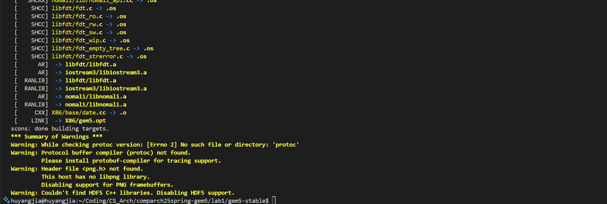
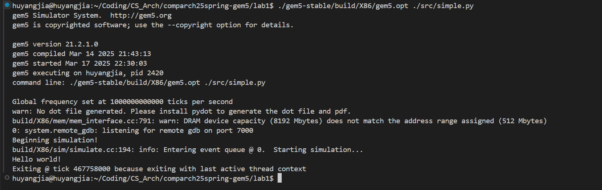
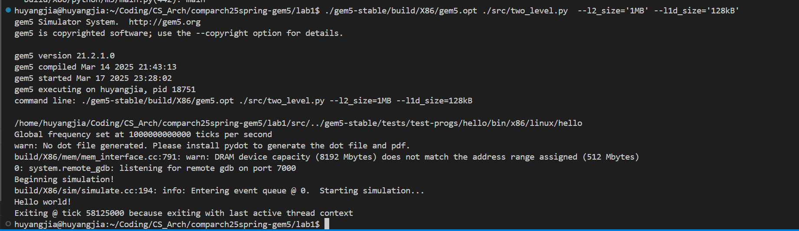

# Lab1 实验报告

**PB22111665 胡揚嘉**

> 实验代码在lab1/src文件夹中


## 1. 配置实验环境，编译gem5

### 实验步骤

1. 解压缩gem5源码包
2. 按照教程推荐，安装依赖

   ```shell
   sudo apt install build-essential git m4 scons zlib1g zlib1g-dev libprotobuf-dev protobuf-compiler libprotoc-dev libgoogle-perftools-dev python-dev python
   ```

   实际上，这里面的`python, python-dev`不需要再次安装，报错，但是不影响进程

   ```
   E: Package 'python-dev' has no installation candidate
   E: Package 'python' has no installation candidate
   ```
3. 编译，查看发现自己有16个核

   ```shell
   scons build/X86/gem5.opt -j15 CPU_MODELS=AtomicSimpleCPU,TimingSimpleCPU,O3CPU,MinorCPU
   ```

### 成功编译gem5截图




## 脚本文件编写和测试

### 结果

`simple.py`的结果



`two_level.py`的结果



### 流程简述

#### 对Simple脚本

1. 创建根对象`System`对象，其是整个系统模拟的底层对象
2. 创建时钟域，设置时钟、电压等系统参数。
3. 创建内存，定义其大小
4. 创建选择的CPU类型
5. 创建系统总线
6. 创建指令缓存和数据缓存，并且将其连接到系统总线上。
7. 对于x86设计，将PIO 和中断端口连接到内存总线
8. 创建一个内存控制器并将其连接到 membus 
9. 实例化系统，并且开始执行。 

#### 对teo_level脚本

1. 创建缓存对象，设置带有自己目标参数的L1Cache, L2Cache对象
2. 从上面的第4步开始(前四部重复)。将L1Cache连接上CPU的端口
3. 例化L2Bus和L2Cache，将L1,L2Cache都连上L2Bus
4. 创建内存总线，并且连接上L2Cache
5. 实例化对象，并且开始执行simulation。

### 收获与反思

在编写`two_level`时，一直报错，显示`NameError: name 'SimpleOpts' is not defined`.

但是不会看报错栈回显，一直默认是`two_level.py`报错，反复修改地址导入无法解决

最后注意到是在`caches.py`内报错，发现对需要参数的情况，使用了`SimpleOpts`文件的内容，但是没有导入（文档未明确提到）

最后得以解决。
